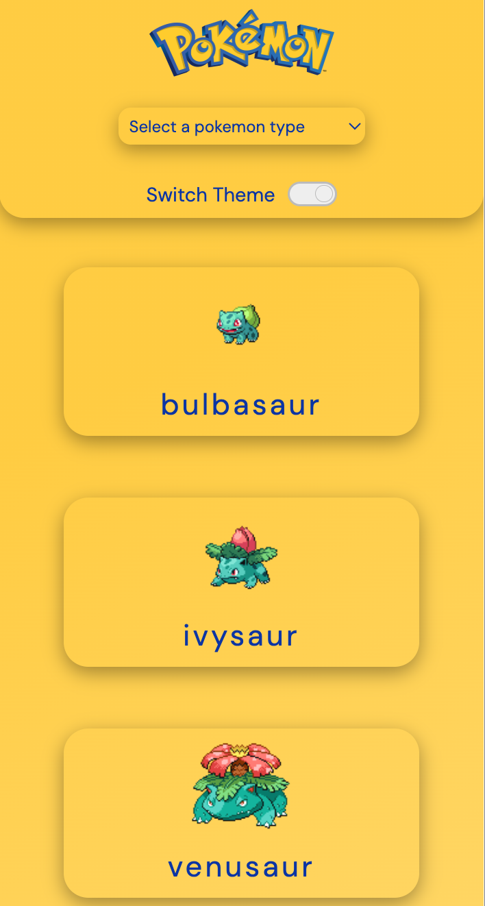
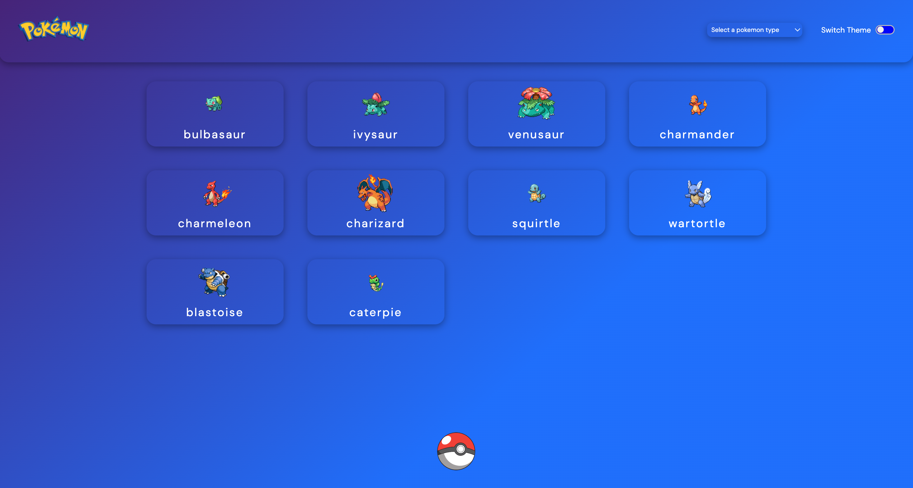

# Pokédex API
# Pokedex Api 
## Table of contents
  - [The Website](#The-Website)
  - [Screenshots](#screenshots)
  - [Functionalities](#Functionalities)
  - [Process Highlights](#Process-Highlights)
  - [Built with](#built-with)

  -[Link](#Link)
  - [Author](#author)
  
### The Website
A website that provides a list of Pokémon cards. A guide that allows fans to learn more about Pokémon and their specificities while also introducing the Pokémon world to those who are not yet familiar with it.

### Screenshot

### Functionalities
 Each card can be clicked to access a page with more specific and detailed information about the Pokémon. By clicking the Poké Ball, the client can load more Pokémon cards (10 per click). The client can also filter Pokémon by type using the select bar and change the website's color theme by clicking the theme toggler button.

### Tools
The website was built primarily using React.js, creating a more dynamic and fluid environment. All the required information was fetched using Axios from the PokéAPI. The React Router DOM library was used to create routes, enabling smooth navigation to each Pokémon's individual page. Most of the styles were implemented using the Styled Components library, making the code structure more organized and facilitating future maintenance. The Context API was used to create two different themes for the website, allowing the user to choose the one that suits them best.

### Process Highlights
The project was challenging. The PokéAPI provides a vast amount of information, so during the planning phase, it was extremely important to explore the API and specifically filter and map the required data. I also researched references to design the layout and studied the Styled Components library to bring my vision to life.
The most difficult part was filtering Pokémon by type. Initially, I tried using a text input, but that required users to already know the Pokémon types, so I switched to a select bar instead. Creating a dynamic structure that renders only the Pokémon of a specific type was challenging, but the final result was very satisfying.
### Built with
- HTML 5
- CSS 3
- React JS
- JSON
- API
- Git/GitHub

### Link

### Author
Rafael Gevú
